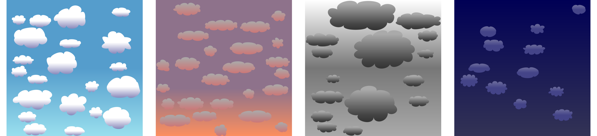

# Procedural Generation of Clouds with Vector Graphics.

This is a just a quick experiment where I tried generating procedural
2D clouds using vector graphics. The experiment is just a program that
outputs a bunch of vector clouds as a SVG file:



## Building and Usage

You can build using make:

```
make
```

You can now generate an SVG with clouds by doing

```
./cloud_gen > out.svg
```

By changing the variable

```
int TYPE = 0;
```

in `main.cpp` you can generate different kinds of clouds.

## How Does this Work
